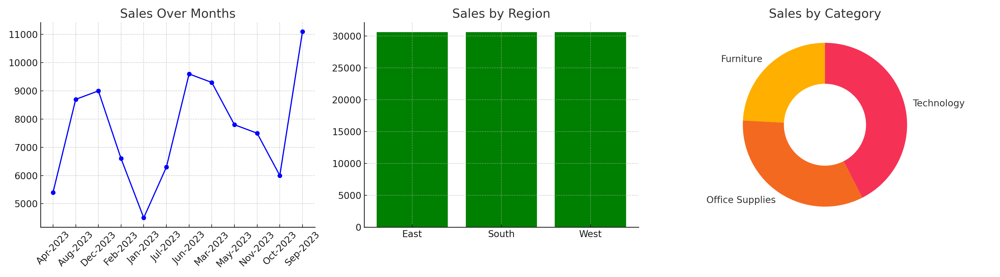

# Task 8: Sales Dashboard using Power BI

## Objective
Create an interactive dashboard to analyze sales performance by product category, region, and month using Power BI.

## Tools Used
- Power BI Desktop
- Superstore_Sales.csv dataset

## Visuals Included
1. **Line Chart**: Monthly Sales Trend
2. **Bar Chart**: Sales by Region
3. **Donut Chart**: Sales by Category
4. **Slicer**: Region filter

## Key Insights
- West region had the highest total sales during Q3.
- Technology category was the best-performing category.
- Sales increased significantly in the first half of the year.
- The South region had the lowest overall sales.

## How to Use
1. Open the Power BI file or import the CSV to recreate the visuals.
2. Use the slicer to filter by Region or Category.

## Screenshot

